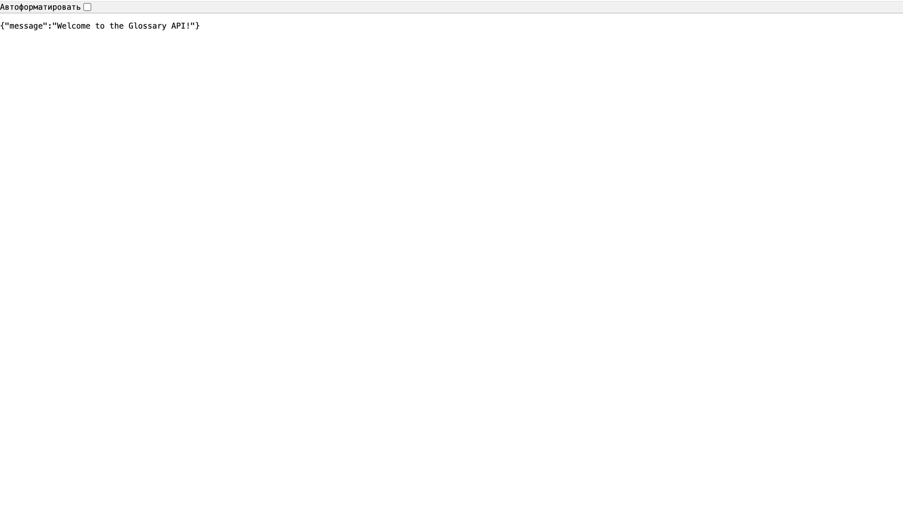
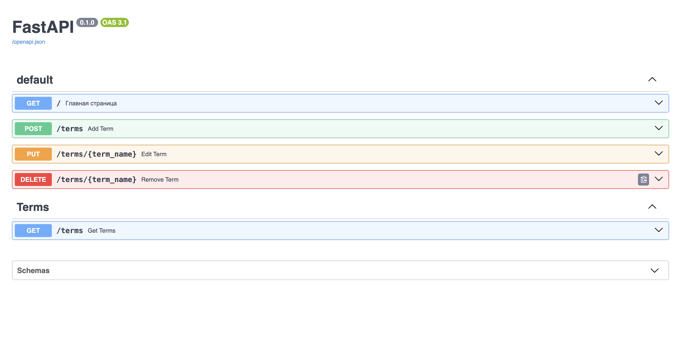
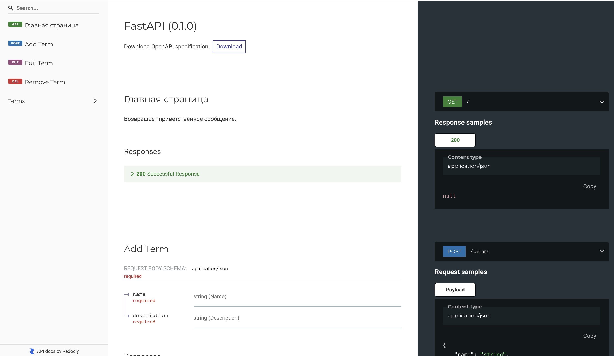

# Glossary API

## Функциональность

- Получение списка терминов
- Добавление нового термина
- Обновление существующего термина
- Удаление термина

### Локальный запуск

1. Клонируйте репозиторий:

   ```bash
   git clone https://github.com/MypyMypy/itmo_fastapi_edu.git
   cd ./itmo_fastapi_edu

   ```

2. Установите зависимости:
   ```bash
   pip install -r requirements.txt
   ```
3. Запустите сервер: 

`uvicorn app.main:app --reload`

или

```
python3 -m venv .venv
source .venv/bin/activate

python -m pip install -r requirements.txt
python -m uvicorn app.main:app --reload
```

4. Откройте в браузере:

- Swagger UI: http://127.0.0.1:8000/docs

- ReDoc: http://127.0.0.1:8000/redoc

## Запуск в Docker

1. `docker compose up --build`

Откройте API по адресу http://127.0.0.1:8000.

2. Откройте в браузере:

- Swagger UI: http://127.0.0.1:8000/docs

- ReDoc: http://127.0.0.1:8000/redoc

## Вид приложения:

1. http://127.0.0.1:8000



2. http://127.0.0.1:8000/docs



3. http://127.0.0.1:8000/redoc

